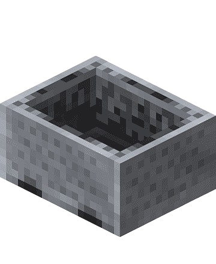

# VanillaMinecarts 

A complete vanilla-style minecart system for PocketMine-MP servers, implementing all Minecraft Java Edition minecart mechanics with enhanced performance.

## Table of Contents

- [Requirements](#requirements)
- [Features](#features)
- [Preview](#preview)
- [Contributing](#contributing)
- [License](#license)

## Requirements 

This plugin requires the following dependencies:

- [InvMenu Virion](https://github.com/Muqsit/InvMenu) - For minecart (hopper & chest) GUI
- PocketMine-MP 5.0.0 or higher
- PHP 8.0 or higher

## Features 

- [x] **Minecart** - Player can sit but sit position isn't persistance
- [x] **Minecart with Chest** - Can open inventory but doesn't work with Hopper
- [x] **Minecart with Hopper** - Can open inventory but doesn't work with Chest
- [x] **Minecart with TNT** - Can explode normally with fire or other causes
- [x] **Rail** - Can run normally but speed isn't determined
- [ ] **Powered Rail** - Not Fully implemented with Redstone
- [ ] **Detector Rail** - Not Fully implemented with Redstone
- [ ] **Activator Rail** - Not Fully implemented with Redstone
- [ ] **Others** - All of Redstone Mechanism is not fully implemented

## Preview 

## Contributing 

All kinds of contribution are welcome
- Send feedbacks.
- Submit bug reports.
- Write / Edit the documents.
- Fix bugs or add new features.

Please create a new Pull Request [here](https://github.com/pixelwhiz/ResinAPI/issues/new)

## License 

This project is licensed under LGPL-3.0. Please see [LICENSE](LICENSE) file for details.